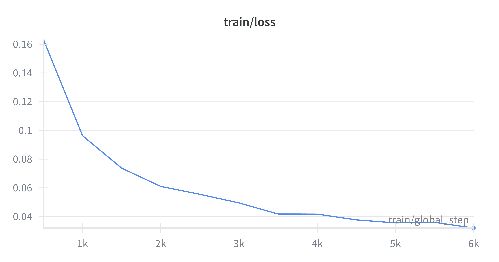
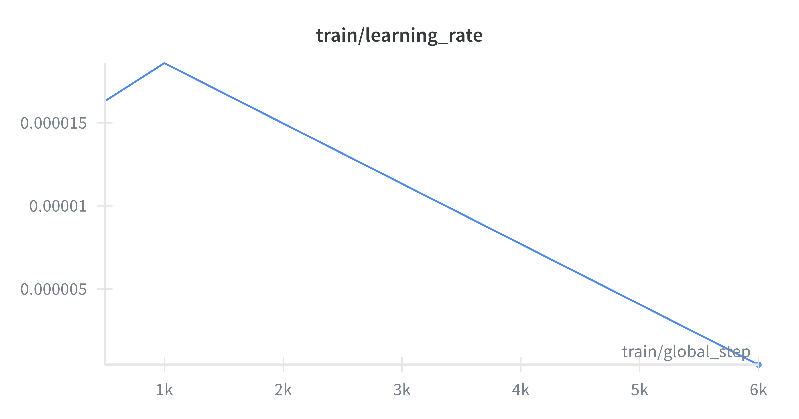
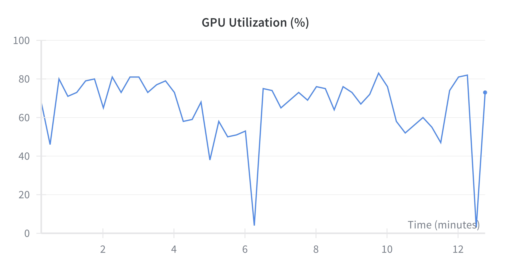
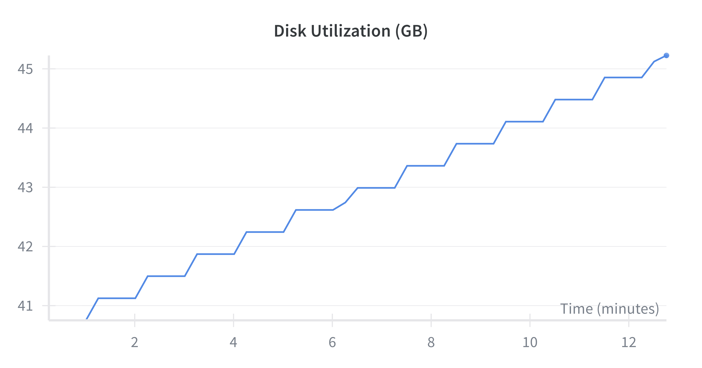

# 🔎 Embeddings-based Code Search (CoSQA) — End‑to‑End

This repository implements a simple but complete **code search engine** with:
- **Indexing** code into a **Qdrant** vector database
- **FastAPI** search API
- **Evaluation on CoSQA** (test partition): **Recall@K, MRR@K, nDCG@K**
- **Fine‑tuning** a bi‑encoder on CoSQA (train) and showing improved test metrics
- **Smart chunking** (Python functions/classes via AST; windowed fallback for other langs)
- **Dev Containers** + `docker-compose` for a one‑command local stack

> ⚠️ Note: Model weights in some folders were deleted to keep this repo light. The code will download base models automatically; fine‑tuned checkpoints will be saved to `models/` during training.

---

## 🧭 Quick Start (TL;DR)

```bash
# 0) Bring up Qdrant + dev container (from repo root on host)
docker compose up -d

# 1) (Optional) Open in VS Code -> "Reopen in Container"
#    or attach a shell into the app container:
docker compose exec app bash

# 2) Install Python deps (inside container)
pip install -r requirements.txt

# 3) Ingest your codebase into Qdrant (smart chunking)
python scripts/ingest.py \
  --input_glob "data/examples/**/*.py" \
  --model sentence-transformers/all-MiniLM-L12-v2 \
  --qdrant-host qdrant --qdrant-port 6333 \
  --qdrant-collection codes --qdrant-recreate \
  --include-comments --max-func-lines 180 --win-lines 120 --overlap-lines 30

# 4) (Optional) Run the search API
python scripts/serve_api.py \
  --backend qdrant \
  --model sentence-transformers/all-MiniLM-L12-v2 \
  --qdrant-host qdrant --qdrant-port 6333 \
  --qdrant-collection codes

# 5) Evaluate on CoSQA (test) with any model or local finetuned dir
python -m codesearch.eval.evaluator \
  --model sentence-transformers/all-MiniLM-L12-v2 \
  --qdrant-host qdrant --qdrant-port 6333 \
  --qdrant-collection cosqa_test_baseline \
  --K 10
```

---

## 🐳 Dev Environment (Docker & VS Code)

### Compose stack
The repo ships with `docker-compose.yml` that defines:
- `qdrant` — the vector DB (ports **6333/REST**, **6334/gRPC** exposed to host)
- `app` — your Python dev container with the repo bind‑mounted at `/workspace`

Start both:
```bash
docker compose up -d
docker compose ps
```

Open the Qdrant UI / REST endpoint at: `http://localhost:6333`

### VS Code Dev Container (recommended)
- `.devcontainer/Dockerfile` builds the dev image (Python 3.12, sets `PYHYONPATH=/workspace/src`).
- `.devcontainer/devcontainer.json` attaches VS Code to the `app` service from compose.

Steps:
1. Open repo in VS Code
2. **Command Palette → Dev Containers: Reopen in Container**
3. A terminal opens inside `/workspace` with all ports forwarded (8000 for API, 6333 for Qdrant).

---

## 📁 Directory Structure

```
.
├── .devcontainer/                 # VS Code dev container config
│   ├── Dockerfile
│   └── devcontainer.json
├── google-colab/                  # Google colab version for fine-tuning of the model
│   ├── main.ipynb
│   └── ziped version 
├── docker-compose.yml             # Brings up qdrant + app
├── dockerfile                     # (lowercase) optional standalone build
├── requirements.txt               # Python deps
├── notebooks/
│   └── how-to-run.ipynb           # runnable demo / report notebook
├── scripts/
│   ├── ingest.py                  # Chunk -> embed -> upsert to Qdrant
│   ├── serve_api.py               # FastAPI server (Qdrant backend)
│   └── train.py                   # Fine-tune + plots + test eval
├── src/codesearch/
│   ├── api/main.py                # FastAPI app (/search): encodes query, queries Qdrant
│   ├── embeddings.py              # SentenceTransformers wrapper
│   ├── index/
│   │   ├── base.py
│   │   └── qdrant_index.py        # Qdrant adapter
│   ├── utils/
│   │   ├── chunkers.py            # Python AST chunker + line-window fallback
│   │   ├── eval.py                # dataset helpers (pick_text, id mapping, etc.)
│   │   └── logging.py
│   ├── metrics/ranking.py         # Recall@K, MRR@K, nDCG@K (binary)
│   ├── eval/evaluator.py          # CoSQA test eval via Qdrant
│   └── train/                     # Fine-tuning utilities
│       ├── trainer.py             # CLI: builds train pairs, trains MNRL, plots loss
│       └── losses.py              # InfoNCE, MNRL, and loggers
├── data/                          # Sample code (gitignored except placeholders)
├── models/                        # Saved checkpoints (you’ll populate)
├── results/                       # Metrics, plots (created by scripts)
├── qdrant_storage/                # Qdrant persistent storage (volume)
└── README.md                      # (this file)
```

---

## 🧩 Part 1 — Index & Search (Qdrant)

### Smart chunking
`src/codesearch/utils/chunkers.py`:
- **Python**: splits by **functions/classes** via `ast`. Long defs are windowed (e.g., 120 lines with 30‑line overlap). Prepends leading `#` comments for context.
- **Others**: line‑window fallback with overlap.
- Each chunk gets payload: `{{path, lang, kind, symbol, start_line, end_line, part, n_parts}}`.

### Ingest into Qdrant
```bash
python scripts/ingest.py   --input_glob "data/examples/**/*.py"   --model sentence-transformers/all-MiniLM-L12-v2   --qdrant-host qdrant --qdrant-port 6333   --qdrant-collection codes --qdrant-recreate   --include-comments --max-func-lines 180 --win-lines 120 --overlap-lines 30
```

### Serve API
```bash
python scripts/serve_api.py   --backend qdrant   --model sentence-transformers/all-MiniLM-L12-v2   --qdrant-host qdrant --qdrant-port 6333   --qdrant-collection codes
```
### Query:
```bash
curl -X POST "http://localhost:8000/search"   -H "Content-Type: application/json"   -d '{{"query":"read csv with pandas", "k":5, "lang":"python"}}'
```

---

## 🧪 Part 2 — Evaluation on CoSQA (test)

The evaluator builds a **Qdrant** index from **CoSQA corpus (test)** and retrieves for **CoSQA queries (test)**. Relevance is matched by id suffix (**qNN ↔ dNN**).

Run:
```bash
python -m codesearch.eval.evaluator   --model sentence-transformers/all-MiniLM-L12-v2   --qdrant-host qdrant --qdrant-port 6333   --qdrant-collection cosqa_test_baseline   --K 10
```

It prints:
- `Recall@K` — fraction of queries with at least one relevant doc in top‑K
- `MRR@K` — reciprocal rank (position‑sensitive)
- `nDCG@K` — position‑sensitive with ideal DCG normalization

> Metrics code: `src/codesearch/metrics/ranking.py`

---

## 🔧 Part 3 — Fine‑tuning (CoSQA train → test)

Train a bi‑encoder with **MultipleNegativesRankingLoss** (in‑batch negatives). The trainer also saves a **training loss curve**.

```bash
python scripts/train.py   --finetune-dir models/cosqa-biencoder   --checkpoint-path checkpoint   --assets-dir results/assets   --batch-size 64 --epochs 1 --lr 2e-5   --qdrant-host qdrant --qdrant-port 6333   --qdrant-collection cosqa_test_bodies   --qdrant-collection-ft cosqa_test_ft   --K 10
```

What it does:
1. Loads **CoSQA train** (queries ↔ corpus by `qNN ↔ dNN`) to create `(query, positive_code)` pairs.
2. Trains with **MNRL**.
3. Records **training loss** (per batch or downsampled) and saves plot to `results/assets/`.
4. Saves the model in `models` folder

Re‑evaluate finetuned model (no code changes to evaluator):
```bash
python -m codesearch.eval.evaluator   --model models/cosqa-biencoder   --qdrant-host qdrant --qdrant-port 6333   --qdrant-collection cosqa_test_finetuned   --K 10
```

---

## 📓 Notebook

`notebooks/how-to-run.ipynb` shows the end‑to‑end flow. To run it **inside the dev container**:

1. With the stack up (`docker compose up -d`) and VS Code attached, open the notebook.
2. Select the Python kernel inside the container.
3. Ensure Qdrant is up (visit http://localhost:6333).

If running via CLI:
```bash
docker compose exec app bash -lc "jupyter nbconvert --to notebook --execute notebooks/how-to-run.ipynb --inplace"
```

## Google Colab 

`main.ipynb` is the main file that you have to run in colab. At the same time do not forget to load the ziped version of repo (given in `google-colab` folder) in your google disk (the account that you use for colab and disk should be the same).

---

## 📊 Results

### Table with Results
| Model                                      | Recall@10 | MRR@10 | nDCG@10 |
|-------------------------------------------|-----------|--------|---------|
| `all-MiniLM-L12-v2` (baseline)            |0.9780|0.8017|0.8456|
| `cosqa-biencoder` (finetuned, +epochs)    |0.9960|0.8877|0.9152|

> Note: In general we can see a good improvement of results 

- **Training loss curve**: see `results/assets`
- **GPU and Disk usage**: see `results/assets`

- **Example**: Before fine-tunning

```
Query q20105 -> hits: [(0, 'd20105'), (225, 'd20330'), (317, 'd20422'), (320, 'd20425'), (12, 'd20117')] ; relevant: [0]
Query q20106 -> hits: [(1, 'd20106'), (377, 'd20482'), (25, 'd20130'), (237, 'd20342'), (487, 'd20592')] ; relevant: [1]
Query q20107 -> hits: [(224, 'd20329'), (2, 'd20107'), (279, 'd20384'), (31, 'd20136'), (448, 'd20553')] ; relevant: [2]
```

- **Example**: After fine-tunning

```
Query q20105 -> hits: [(0, 'd20105'), (12, 'd20117'), (225, 'd20330'), (163, 'd20268'), (317, 'd20422')] ; relevant: [0]
Query q20106 -> hits: [(1, 'd20106'), (377, 'd20482'), (25, 'd20130'), (80, 'd20185'), (60, 'd20165')] ; relevant: [1]
Query q20107 -> hits: [(2, 'd20107'), (224, 'd20329'), (185, 'd20290'), (51, 'd20156'), (83, 'd20188')] ; relevant: [2]
```

### Visuals


<p align="center">
  
  
</p>


<p align="center">
  
  
</p>


---

## 🗣 Discussion

- All three metrics improved—Recall@10: 0.9780 → 0.9960, MRR@10: 0.8017 → 0.8877, nDCG@10: 0.8456 → 0.9152—so the model both finds the right code more often and ranks it higher. This is exactly what MultipleNegativesRankingLoss tends to deliver: tighter alignment of query↔code positives and stronger separation from in-batch negatives, which boosts top-rank precision (MRR/nDCG) while also broadening coverage (Recall) when the domain matches the fine-tuning data.

---

## 🧯 Troubleshooting

- **`qdrant` hostname not found**: ensure you run via `docker-compose` and VS Code attaches to the **app** service in the same network.
- **Dimension mismatch**: delete/recreate collection when switching encoders.
- **No loss plotted**: check the training script flags; confirm the logger/evaluator is enabled.

---

## 📄 License

See [`LICENSE`](LICENSE).

---

## 🙏 Acknowledgements

- [Sentence-Transformers](https://www.sbert.net/)
- [Qdrant](https://qdrant.tech/)
- CoSQA via [Hugging Face Datasets](https://huggingface.co/datasets/CoIR-Retrieval/cosqa)
